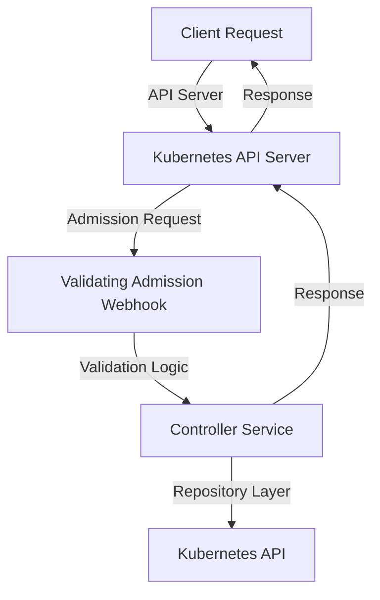
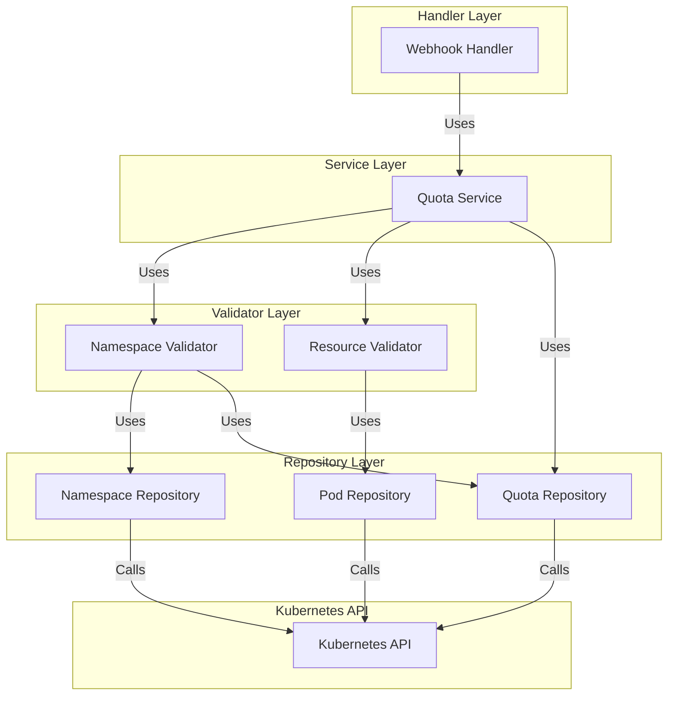
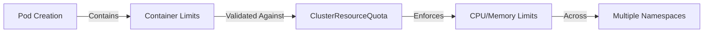
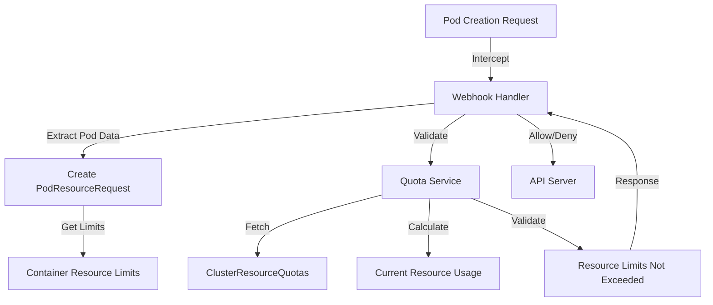

# PAC Resource Sharing Validation Webhook (pac-quota-controller)

This repository contains the PAC Resource Sharing Validation Webhook. It provides a webhook service for validating resource sharing requests in Kubernetes clusters. The project is built in Go and follows modern best practices and tools.

## Overview

The PAC Resource Sharing Validation Webhook ensures that Kubernetes pods adhere to resource sharing constraints defined in ClusterResourceQuota custom resources. It validates pod creation and updates to enforce CPU and memory limits across namespaces.

## Architecture

The architecture of the PAC Resource Sharing Validation Webhook is designed to integrate seamlessly with Kubernetes. It uses a Validating Admission Webhook to intercept and validate resource requests. Below is a high-level architecture diagram:



### Components

1. **Validating Admission Webhook**:
   - Intercepts requests to the Kubernetes API server.
   - Routes requests to appropriate handlers based on resource type.

2. **Service Layer**:
   - Provides business logic coordination between repositories and validators.
   - Centralizes quota validation operations.

3. **Repository Layer**:
   - Handles all direct interactions with Kubernetes API.
   - Includes specialized repositories for namespaces, pods, and ClusterResourceQuotas.

4. **Validator Layer**:
   - Contains pure validation logic without direct API calls.
   - Includes namespace and resource validators.

5. **ClusterResourceQuota Custom Resource**:
   - Defines resource quotas (CPU, memory) across multiple namespaces.
   - Ensures fair resource sharing in multi-tenant environments.

## Component Architecture

The following diagram shows the detailed component architecture:



## Resource Validation

The webhook validates pod resources based on **resource limits** defined in container specifications. This ensures accurate enforcement of ClusterResourceQuota constraints:



## Usage

1. **Clone the Repository**:

   ```bash
   git clone https://github.com/powerhome/pac-quota-controller.git
   cd pac-quota-controller
   ```

2. **Set Up Environment Variables**:
   Ensure the following environment variables are set:
   - `PAC_RSVW_PORT`: Service port (default: 443)
   - `PAC_RSVW_LOG_LEVEL`: Logging level (default: info, use "debug" for detailed logging)
   - `PAC_RSVW_ENV`: Environment (dev/staging/prod)
   - `PAC_RSVW_TLS_CERT_FILE`: Path to TLS certificate file
   - `PAC_RSVW_TLS_KEY_FILE`: Path to TLS key file

3. **Build the Project**:

   ```bash
   make build
   ```

4. **Run Tests**:

   ```bash
   make test
   ```

5. **Deploy to Kubernetes**:
   Use the provided Helm chart to deploy the webhook:

   ```bash
   helm install pac-quota-controller ./charts/pac-quota-controller -n pac-system
   ```

   To enable debug logging during deployment:

   ```bash
   helm install pac-quota-controller ./charts/pac-quota-controller -n pac-system --set env.PAC_RSVW_LOG_LEVEL=debug
   ```

6. **Configure ClusterResourceQuota**:

   ```yaml
   apiVersion: pac.powerhome.com/v1alpha1
   kind: ClusterResourceQuota
   metadata:
     name: test-quota
   spec:
     namespaces:
       - namespace1
       - namespace2
     hard:
       cpu: "1"
       memory: "1Gi"
   ```

7. **Test with Sample Pod**:
   Create a pod in one of the namespaces specified in the ClusterResourceQuota and verify that the resource limits are enforced.

## Workflow

The following diagram illustrates the validation workflow:



## Troubleshooting

- **Enable Debug Logging**: Set `PAC_RSVW_LOG_LEVEL=debug` to get detailed logs
- **Check RBAC Permissions**: The webhook needs permissions to list pods and ClusterResourceQuotas
- **Validate CRD Installation**: Ensure the ClusterResourceQuota CRD is properly installed

## Contributing

Please refer to the [CONTRIBUTING.md](CONTRIBUTING.md) file for detailed guidelines on how to contribute to this project.
