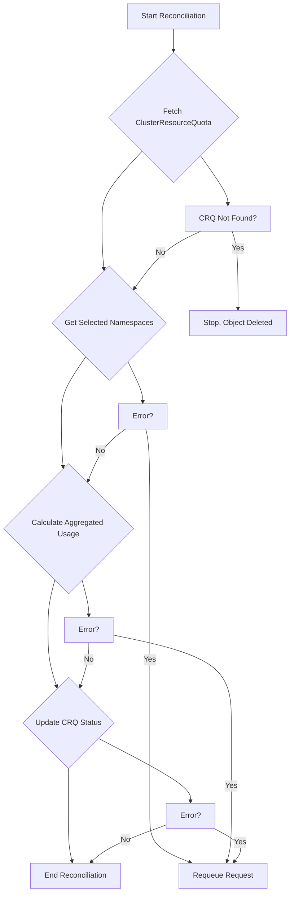
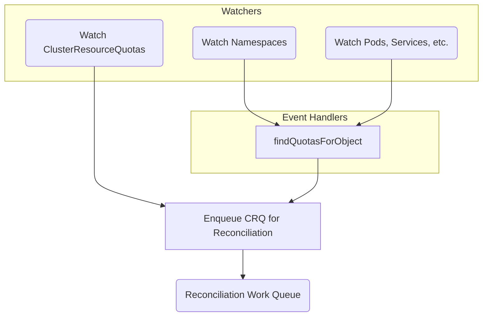

# ClusterResourceQuota Reconciliation Loop

This document provides a detailed explanation of the reconciliation loop for the `ClusterResourceQuota` controller. Understanding this process is key to debugging and extending the controller's functionality.

## Overview

The controller's primary responsibility is to monitor `ClusterResourceQuota` (CRQ) objects and the resources they track across selected namespaces. It ensures that the status of each CRQ accurately reflects the aggregated usage of resources like Pods, Services, and ConfigMaps.

The reconciliation process is triggered by two main types of events:

1. Changes to a `ClusterResourceQuota` object itself.
2. Changes (create, update, delete) to a tracked resource (e.g., `Pod`, `Namespace`) in the cluster.

## Main Reconciliation Loop

The `Reconcile` function is the entry point for the main loop. It is triggered when a reconciliation request is added to the work queue by the event handlers.

### Steps Explained

1. **Fetch ClusterResourceQuota**: The controller starts by fetching the `ClusterResourceQuota` instance that triggered the reconciliation. If it's not found, the process stops, as the object was likely deleted.
2. **Get Selected Namespaces**: It identifies all namespaces that match the `namespaceSelector` defined in the CRQ's spec.
3. **Calculate Aggregated Usage**: The controller calculates the total usage of tracked resources (e.g., `pods`, `services`) across all selected namespaces.
    - *Note: Pod resource calculation follows the Kubernetes standard: `Overhead + Max(sum(apps), max(inits))`, while excluding terminated containers.*
4. **Update CRQ Status**: The controller updates the `.status` field of the CRQ with the newly calculated total usage and the per-namespace usage breakdown. It uses a server-side patch to prevent write conflicts.
5. **End Reconciliation**: If all steps are successful, the reconciliation is complete. If any step fails, the request is requeued for a later attempt.

## Event Handlers and Watchers

The controller uses watchers to monitor changes to Kubernetes objects and trigger reconciliations.

### Handler Logic Explained

- **`findQuotasForObject`**:
  - **Triggered by**: Changes to `Namespace` objects and tracked resources like `Pods`, `Services`, `ConfigMaps`, etc.
  - **Logic**: This unified handler processes both namespace events and tracked resource events. For Namespace objects, it processes them directly. For other objects, it first retrieves the namespace they belong to. It then checks if the namespace's labels match any `ClusterResourceQuota`'s `namespaceSelector`. If a match is found, it enqueues that CRQ for reconciliation. This ensures that the controller reacts to namespaces being added to or removed from a quota's scope, as well as changes to tracked resources within those namespaces.
  - **Exclusion Logic**: The handler automatically excludes the controller's own namespace and any namespaces marked with the exclusion label to prevent unnecessary reconciliation loops.
  - **Logging**: Logs a "Processing object event, finding relevant CRQs" message, including contextual information about the object that triggered the event.
