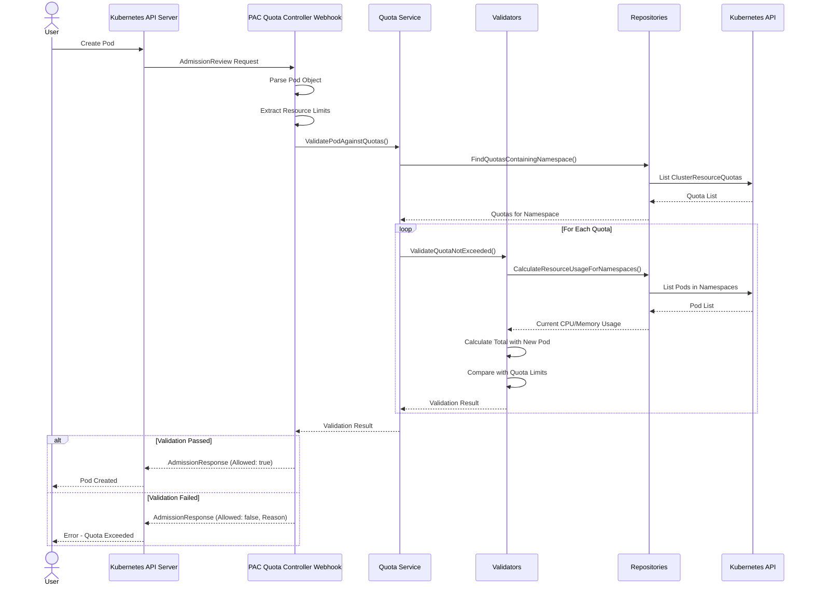
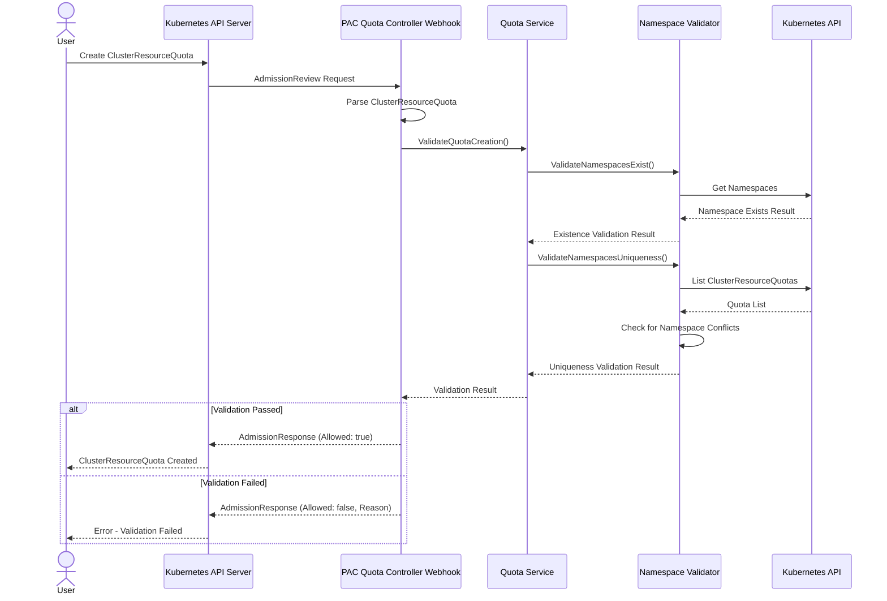

# PAC Resource Sharing Validation Webhook: Sequence Diagrams

This document provides sequence diagrams illustrating the key workflows of the PAC Resource Sharing Validation Webhook (pac-quota-controller).

## Pod Validation Workflow

The following sequence diagram shows the validation flow when a Pod is created:

## ClusterResourceQuota Validation Workflow

When creating or updating a ClusterResourceQuota, the system validates that namespaces are not already associated with other quotas:

## Key Components

The sequence diagrams illustrate the clean separation between the different layers of the PAC Quota Controller architecture:

1. **Webhook Handlers**: Process incoming AdmissionReview requests
2. **Services**: Implement business logic for validating resources
3. **Validators**: Contain specific validation logic for different scenarios
4. **Repositories**: Interact with the Kubernetes API to retrieve and calculate resource data

This layered approach ensures that the codebase remains modular, testable, and maintainable as the application grows.
